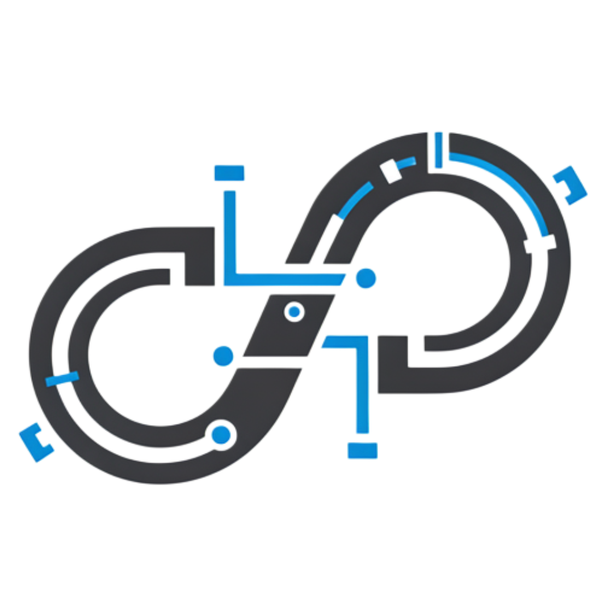

<p align="center">
  
</p>

<h1 align="center">DITL — Developer-In-The-Loop</h1>

<p align="center">
  <strong>AI finds every tunable knob in your codebase. You twist them.</strong>
</p>

<p align="center">
  
  
  
</p>

---

## Why?

You tweak a prompt, change a threshold, bump a timeout — then re-run your app to see what happens. Repeat fifty times.

**DITL automates the boring part.** Point it at any project, let AI scan every file, and get a single dashboard where you can:

- Slide a number, flip a boolean, rewrite an entire system prompt
- Save changes directly to source — no copy-paste, no hunting for the right file
- See a full history of every tweak you made and what changed

No config files. No SDK. Just open your project folder and start tuning.

---

## TL;DR

```
npm install → npm run dev → open folder → AI scans → tweak params → save to source
```

---

<p align="center">
  <br>
  <em>Home — open any project and kick off an AI scan</em>
</p>

<p align="center">
  <br>
  <em>Parameters — every tunable knob, grouped by category</em>
</p>

<p align="center">
  <br>
  <em>History — click any entry to inspect the full before/after diff</em>
</p>

---

## Features

| | |
|---|---|
| **AI-Powered Discovery** | Scans your entire codebase and finds parameters, prompts, thresholds, feature flags — anything tunable |
| **Live Editing** | Sliders for numbers, toggles for booleans, full text editors for prompts — changes write directly to your source files |
| **Change History** | Every save is recorded with full before/after values, file paths, risk level, and timestamps. Click any entry to see the complete diff |
| **Test Runner** | Auto-detects and runs your project's test suite after changes |
| **Multi-Provider** | Works with OpenAI, Anthropic, OpenRouter, or **Ollama** for fully local, offline inference |
| **Cross-Platform** | macOS, Windows, Linux — native Electron app |

---

## Quick Start

### Prerequisites

- **Node.js** ≥ 18
- An API key from [OpenAI](https://platform.openai.com/api-keys), [Anthropic](https://console.anthropic.com/), or [OpenRouter](https://openrouter.ai/) — **or** [Ollama](https://ollama.com/) installed locally (no API key needed)

### Install & Run

```bash
git clone https://github.com/<your-username>/ditl.git
cd ditl
npm install
npm run dev
```

### First Use

1. Go to **Settings** → choose your provider (paste your API key, or select **Ollama** for local inference)
2. Click **Open Project Folder** → select any codebase
3. Click **Analyze with AI** → wait for the scan
4. **Tweak parameters** → hit **Save All**
5. Check the **History** tab to review what changed

---

## Using Ollama (Local / Offline)

Don't want to send your code to a cloud API? Run everything locally:

1. [Install Ollama](https://ollama.com/) and pull a model:
   ```bash
   ollama pull llama3
   ```
2. Make sure Ollama is running (`ollama serve` or the desktop app)
3. In DITL **Settings**, select **Ollama (Local)** as the provider
4. Set the model name (e.g. `llama3`, `codellama`, `mistral`, `deepseek-coder`)
5. Optionally change the URL if Ollama runs on a different host/port

> **Tip:** Larger models (≥ 13B parameters) produce significantly better results. `codellama:34b` or `deepseek-coder:33b` are recommended if your hardware allows it.

---

## Supported Parameter Types

| Type | UI Control | Examples |
|------|-----------|----------|
| `number` | Slider + input | temperature, learning_rate, max_tokens |
| `boolean` | Toggle switch | feature flags, debug modes |
| `select` | Dropdown | model names, strategies |
| `string` | Text input | API URLs, keys |
| `text` | Multiline editor | System prompts, templates |

## Supported Languages

DITL scans files with these extensions by default:

`.py` `.js` `.ts` `.jsx` `.tsx` `.yaml` `.yml` `.json` `.toml` `.cfg` `.ini` `.env` `.rb` `.go` `.rs` `.java` `.kt` `.cs` `.cpp` `.c` `.h`

---

## Project Structure

```
ditl/
├── src/
│   ├── main/           # Electron main process
│   │   ├── main.js     # Window management, IPC handlers
│   │   └── preload.js  # Context bridge (secure API surface)
│   ├── renderer/       # UI
│   │   ├── app.js      # Single-file vanilla JS renderer
│   │   ├── index.html
│   │   └── styles/
│   └── core/           # Business logic
│       ├── ai-engine.js   # Multi-provider AI client + chunked analysis
│       ├── scanner.js     # File discovery & filtering
│       ├── writer.js      # Safe parameter replacement in source
│       ├── settings.js    # User config (~/.ditl/settings.json)
│       └── test-runner.js # Auto-detect & run project tests
├── package.json
└── README.md
```

---

## Security

- **API keys are never stored in the project.** They live in `~/.ditl/settings.json` on your machine and are excluded from version control.
- The renderer runs with `contextIsolation: true` and `nodeIntegration: false` — the UI can only call the explicitly exposed IPC methods.
- No telemetry, no analytics, no network calls except to your chosen AI provider.

---

## License

**Business Source License 1.1 (BSL 1.1)**

- ✅ **Free for personal use, education, research, and internal company use**
- ✅ **Source code is open and available** — read, modify, fork, contribute
- ✅ **Converts to Apache 2.0** automatically on the Change Date defined in `LICENSE`
- ❌ **Commercial redistribution** (selling DITL or offering it as a hosted service) requires a commercial license

See [LICENSE](LICENSE) for the full text.

---

<p align="center">
  Built for developers who optimize by feel.
</p>
